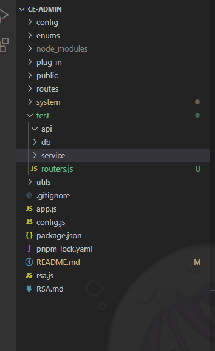
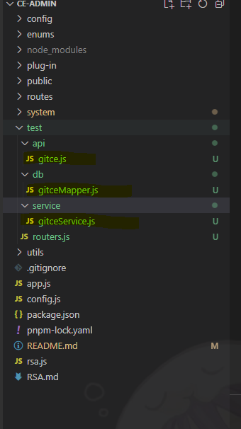
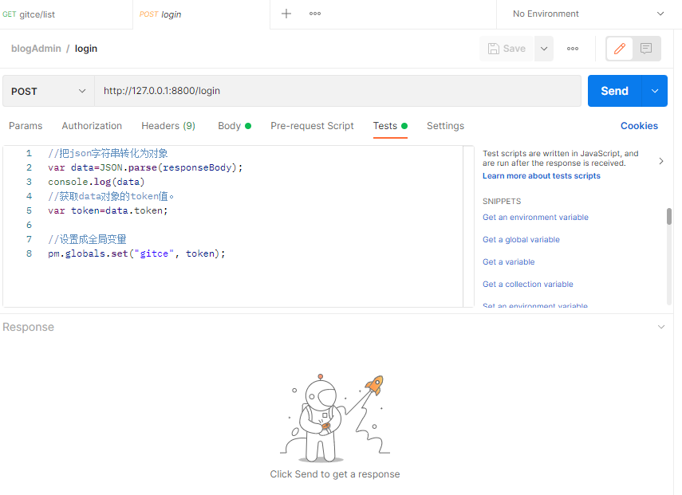
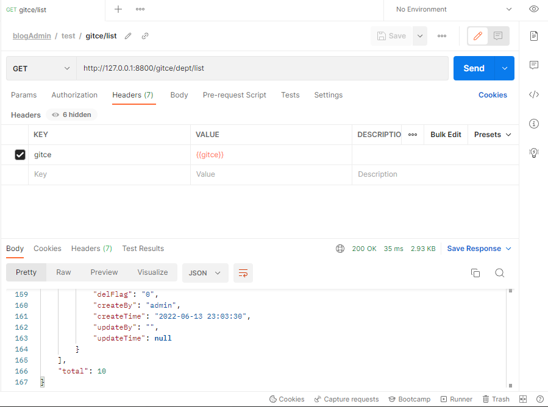
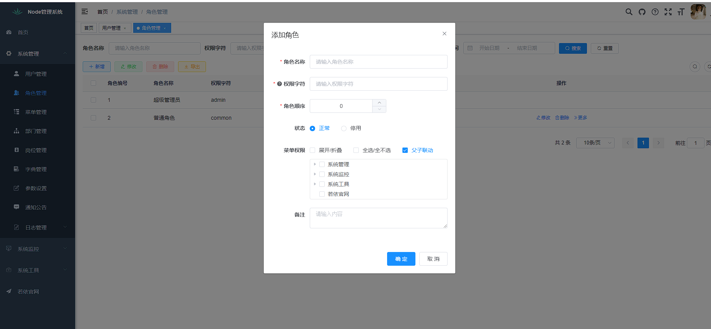

# ce-admin

# 🎉后台管理系统 express + vue2

先介绍一下为什么用express当后台,因为因为我很多年前，封装了一个express 框架，只是 从1.0 升级到2.0 
哈哈，都是借口，后面有空 去做个koa的框架吧，展示够用，我还需要去研究electron,毕竟软件开发才香，啥都学，我很菜，啥都会一丢丢丢，我是一个程序小白。花了2个多星期拿RuoYi框架改了一下下。

## 项目地址

 https://github.com/gitcetop/ce-admin


## 事事不顺心，只能靠写代码来发泄一下
我不会英语你能拿我乍地，我就摆烂。

## Redis 

你先需要安装一个redis

路径为：ce-admin\utils\redis.js

可行配置


## express
```sh
// 依赖安装
pnpm i   

// 项目运行
pnpm dev

// 至于打包自行解决吧，我记得这里会出现问题，要修改文件 依赖的 const path = require('path') ，（没有最好）我相信你们能直接解决好。 
pnpm build
```

1. 数据权限、路由拦截，等等一堆玩意。
2. 数据库修改 ce-admin\config\dbconfig.js ，找到这个文件夹，把 ce-admin\sql\node.sql 添加到mysql上就行了。都是RuoYi的没改动。
3. 路由注册
 ``` js
/**
 * path: 路由地址     => String
 * method: 请求类型   => String
 * component:回调方法 => Function
 * preAuthorize:{
 *    pathPermi: true || false  , 自动匹配接口权限   【默认值 flase】
 *    isAuth: true || false , 是否开启头部校验  【默认值 true】
 *    hasPermi:'system:user:list'  ,  string
 *    hasAnyPermi:['system:user:list'], Array string
 *    lacksPermi:'system:user:list'  ,  string 不符合权限 取反
 * }
 */
 let systemUser = require('@/xxx/xxx.js')
 let post = require('@/xxx/xxx')
 let routers = [
    {
    path: '/system',
    children: [
    {
        path: '/user',
        method: 'post',
        component: systemUser.add,
        preAuthorize: {
         hasPermi: 'system:user:add'
        }
    },
    {   // 多级路由写法 
    path: '/post',
    children: [
        {
        path: "/:id",
        method: 'get',
        component: post.getInfo,
        preAuthorize: {
            isAuth: false
        }
        },
        {
        path: "/list",
        method: 'get',
        component: post.list,
        preAuthorize: {
            isAuth: false
        }
        }
    ]
    }
 ]

 ```

##  express 请求写法

为什么要分开？？？ 好吧，简洁，强迫症，模块好调用

### 第一步
在 ce-admin 目录创建一个文件夹 test
然后 ce-admin\test 目录下创建文件夹 api、db、service，这三个文件夹，最后在创建一个routers.js



### 第二部创建3个js

1. ce-admin\test\api\gitce.js
2. ce-admin\test\db\gitceMapper.js
3. ce-admin\test\service\gitceService.js
4. ce-admin\test\routers.js




### 构建数据库不会就看（system）模块【字符串小心空格哦】

``` js
// ce-admin\test\db\gitceMapper.js 文件

const { handlePage, sqlFunKey } = require('@/utils/mysql')


let selectDeptVo = "SELECT * FROM sys_dept "

let selectDeptList = (rows = {}) => {
    let sqlString = selectDeptVo

    let sqlarr = [
        {
            key: 'deptId',
            sql: ' AND dept_id = ? ',
            isNotZero: true // 条件
        }
    ]

    let sqlRow = sqlFunKey(rows, sqlarr)
    if (sqlRow.value.length > 0) sqlRow += " WHERE "
    sqlString += sqlRow.sqlString

    return {
        sqlString,
        value: sqlRow.value
    }
}

module.exports = {
    selectDeptList
}
```


### 服务方法构建

```js
// ce-admin\test\service\gitceService.js 文件
const dbconfig = require('@/config/dbconfig')
const gitceMapper = require('../db/gitceMapper')


/** 查询部门list */
const selectDeptList = async (dept = {}) => {
    let db = gitceMapper.selectDeptList(dept)
    let rows = await dbconfig.sqlConnect(db.sqlString, db.value, 'yyyy-MM-dd HH:mm:ss') // 第3个参数，不添加时间不会格式化
    return rows || []
}

/** 查询部门总条数 */
const selectTotal = async (dept = {}) => {
    let body = JSON.parse(JSON.stringify(dept))
    delete body.pageNum
    delete body.pageSize
    let db = gitceMapper.selectDeptList(body)
    let sqlString = db.sqlString.replace(/^select(.*?)from/gi, 'SELECT count(0) AS countNum FROM ')
    let [info] = await dbconfig.sqlConnect(sqlString, db.value)
    return Number(info.countNum)
}


module.exports = {
    selectDeptList,
    selectTotal
}
```

### api 方法构建

```js
// ce-admin\test\api\gitce.js 文件
const gitceService = require('../service/gitceService')

/**
 *  首页文章
 */
let list = async (req, res) => {
    let rows = []
    let total = await gitceService.selectTotal(req.query)
    if (total > 0) rows = await gitceService.selectDeptList(req.query)

    res.send({
        code: 200,
        msg: "查询成功",
        rows,
        total
    })
}


module.exports = {
    list
}
```

### 路由路径写法

```js
// ce-admin\test\routers.js 文件
let gitceRouter = require('./api/gitce')

let routers = [
    {
        path: "/gitce",
        children: [
            {
                path: '/dept/list',
                method: 'get',
                component: gitceRouter.list,
                preAuthorize: {
                    hasPermi: 'system:dept:list' // 路由权限拦截
                }
            },
        ]
    }
]

module.exports = routers
```

### 路由挂载

注意路由递归方法可在优化

```js
// ce-admin\routers.js 文件

let system = require('@/system/routers')
let test = require('@/test/routers')  // 新增


const routerAll = [
  ...system,
  ...test // 新增
]

```

http://127.0.0.1:8800/gitce/dept/list

需要设置请求头






## vue-admin-web 后台

### 后台代码改动

只修改了RuoYi 加密，密码修改，用户密码修改，用户密码登录，这些有用到rsa 加密




【缓存监控、服务监控、数据监控、定时任务、系统接口】以上模块是没做

其他都对接，不过代码生成 这个还没做，没空。不过现在基本上正常模块都可以用了，主要最近没空。在构建桌面重复利用引擎。

electron 内核重复利用，用来构建小程序最合适不过，哈哈，专门写一些摸鱼工具。

